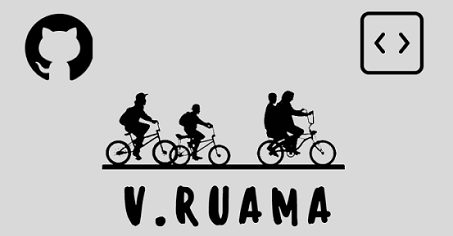

# Oi, eu sou a Vanessa Ruama

- 👨‍💻 Sou Analista Desenvolvedora II
- 🔭 Atualmente trabalho na **TOTVS** - Linguagens Advpl e TLPP
- 📝 Estou sempre estudando e me atualizando sobre novas tecnologias
- 📝 Sou graduada em Gestão de TI e ADS
- ⚡ Um fato sobre mim: Minha série favorita é **Stranger Things**

# Linguagens e ferramentas:

   

   

   

# Projeto da Faculdade:
- 📝 Aplicativo Mobile utilizando o Xamarin e Node.js - https://github.com/2022S1P3/PromoverSaude
